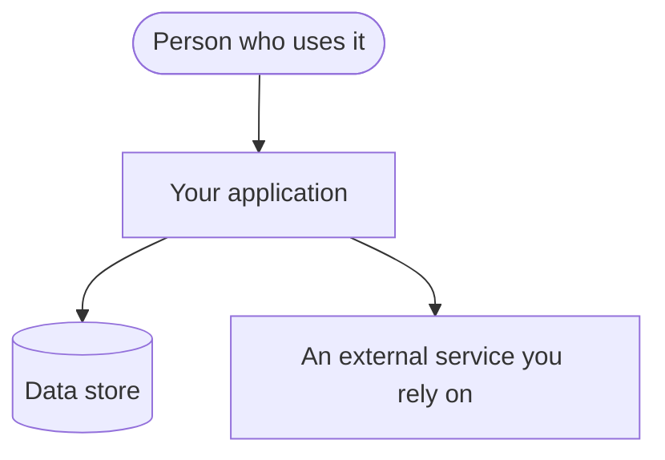

# Architecture

<!-- Starting shape for docs/architecture.md — how your product is put together, at the level a newcomer needs
to find their way. Copy it to docs/architecture.md and replace the guidance here with the real thing. This
follows the widely-used arc42 outline (context, building blocks, runtime, decisions) and carries a C4-style
container diagram drawn as a mermaid `flowchart` so it renders on GitHub and stays diffable — but the operator
never needs those framework names; the plain section headings below are all they see. This is a fuller-detail
document, authored only on the "write it down properly" path, and it is NOT checked by the engine — it is yours
to get right. Keep the diagram in stable `flowchart` form so its shape is reviewable in a diff. Strip these
comment blocks and the bracketed placeholders before committing. -->

## Overview and context

<One or two short paragraphs: what the system does, who and what it talks to (users, external services), and the
boundary between what you build and what you depend on.>

## The main parts

<!-- The C4-style container view: the big building blocks and how they connect. Keep it a `flowchart`; give each
node a plain name; label each arrow with what flows. Replace the example nodes with your real parts. -->

<A short list under the diagram: one line per part naming what it is responsible for.>

- **<Part name>** — <what it is responsible for.>
- **<Part name>** — <what it is responsible for.>

## How it behaves at runtime

<The one or two flows that matter most, each as the ordered steps a request takes through the parts above —
enough that someone could follow the path, not every path.>

## Key decisions

<The handful of architectural choices worth recording, each as: what you chose, and why — and, where it matters,
what you chose against. This is an at-a-glance summary inside this document; a significant choice you want kept
as its own record — especially one you are reopening — the engine writes as a separate decision record under
docs/adr/, which is where a later session looks before re-opening a settled choice.>

- **<Decision>.** <What was chosen and why; what it was chosen against.>
