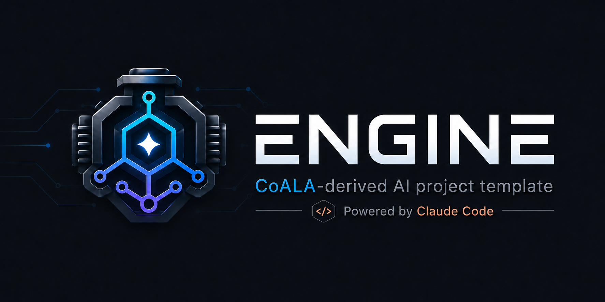

<!-- engine-template:landing-front -->

  

  
<strong>Scaffolding that lets you direct AI on real engineering work — and stay the person who decides — without reading a line of code.</strong>

The Engine is not a faster, more capable autonomous agent. It's the opposite bet: a way to keep a human who *can't* read code firmly in charge of AI that can. Its job is to make what the AI does **legible** and **consentable** to that person — so you can direct serious work on a real project, and approve it, on evidence you can actually judge.

## This is for the person who can't verify the work — and has to govern it anyway

You direct the work, and you approve every change, from the very first commit. You are not expected to read code, debug a failure, or take the AI's word that it did the right thing. Most AI tooling quietly assumes a power user who can check the output. The Engine assumes you can't — and is built, end to end, so that you don't have to.

## You approve the work without reading the code

Every change the AI proposes arrives as a pull request, and nothing reaches your main branch until you say so. But your approval never rests on reading or trusting the code. It rests on evidence you *can* weigh:

- a demonstration you run yourself, and vary, to see the behavior with your own eyes;
- independent checks that have to pass before a change is even offered to you;
- a plain-language account of what changed, why, and what it could put at risk — including an honest statement of how sure anyone can be.

That bundle — not a code review — is the gate. It is the whole point of the Engine.

## What you get to stand on

Every AI session starts cold: it remembers nothing. Left there, you'd re-explain your project every time and hope for the best. Instead, the Engine gives the work a durable footing — committed to the repository itself, and open to you:

- where things stand right now, and what's still unfinished;
- the decisions made so far and *why* — written down where you can read them, not buried in a chat log only the AI ever saw;
- a current map of how the project fits together;
- a sense of what matters next, so a fresh session picks up instead of starting over.

This isn't a catalog of the AI's abilities — it's the ground *you* direct from: committed, inspectable, and yours. The AI builds faithfully not because it's clever, but because the ground under it is solid and in plain sight.

## Constrained autonomy is the feature

Slow, gated, and verifiable beats fast and opaque. The Engine deliberately trades raw autonomy for trust: work is proposed before it lands, lands only behind your approval, and can always be undone; what governs the work is written down and citable; and if a supporting service goes down, it falls back to plain files in git rather than stranding you. You give up the thrill of an agent that simply runs — and you get work you can actually stand behind.

## Get started

1. Click **Use this template** above to create your own repository.
2. Open it in [Claude Code](https://claude.com/claude-code), or in [Codex](https://openai.com/codex/) — the Engine runs natively in either.
3. A guided first-run setup walks you through your choices and stands up the Engine for your project.

## What's inside

The Engine externalizes the cognition and controls it runs on — each one a committed, inspectable subsystem rather than a black box:

- **Memory** — a git-committed, append-only memory ledger with a full-text search index: it captures decisions, pushback, and lessons per session and recalls them by relevance, with AI-judged consolidation and frecency-scored retention, so signal compounds and noise decays across sessions.
- **State** — an externalized, committed state cursor: the standing-situation pointers and open-debt count a cold session reads first to orient deterministically, before it touches anything.
- **Knowledge** — a knowledge graph derived from the repository's own surfaces and regenerated on change — entities, relationships, and neighbors, queryable over MCP — so a session maps how the project actually fits together from source, not from guesswork.
- **Attention** — a committed prioritization policy plus a deterministic ranking function that budgets what surfaces at boot and orders the work queue: explicit and inspectable, not an opaque heuristic.
- **Guardrails & the review gate** — a deterministic validation suite (presence, coverage, shape, and coherence checks) gating every pull request, a protected `main`, and a guardrail-weakening classifier that forces an explicit, logged acknowledgment for any change that relaxes a check.
- **Explore / Build modes** — an enforced write-gate: read-only investigation and planning by default, file edits only after a deliberate build transition, every change landing as a reviewable pull request — autonomy bounded by construction, not by good behavior.
- **One-shot provisioning** — an instantiator that runs gather → confirm → apply → verify → retire on first use: it installs only the modules you select, wires them in, verifies coherence, and self-deletes the setup scaffolding.
- **Native in Claude Code and Codex** — one canonical Engine core with a native adapter per AI runtime: wired into Claude Code (its hooks, skills, agents, and MCP control plane) and into Codex (its hooks, skills, agents, and project-scoped MCP), with a parity check that keeps every capability paired across the two and a committed ledger for the few sanctioned differences. Built to degrade to plain git-tracked files when an out-of-repo substrate is unavailable, so a broken service never strands the work.

## Runtime support

The same Engine serves both runtimes from one core; the differences worth knowing:

| Capability | Claude Code | Codex |
|---|---|---|
| Instruction floor | `CLAUDE.md` (conduct auto-imported) | `AGENTS.md` (conduct by required reading — an instruction, not a mechanism) |
| Session hooks (boot, write-gate, memory, status) | Native, on by default | Native; **requires your one-time approval** (`/hooks`), and re-approval after any Engine update that changes them — the Engine tells you when |
| Explore / Build write-gate | PreToolUse gate | Same gate; Codex's own docs call its hook a guardrail, not a complete boundary — the protected branch and your merge remain the wall on both |
| Build entry | `/engine-start` or plan approval | `$engine-start` only (Codex has no plan-approval signal) |
| Typed commands | `/engine-…` (10) | `$engine-…` (9 — `engine-routine` ships with its Codex backend in a follow-up) |
| Review personas | 10 native agents | The same 10, rendered natively (read-only sandbox) |
| Memory & knowledge servers | `.mcp.json` | `.codex/config.toml` (trusted projects only) |
| Session-memory capture | Native transcripts | Dedicated reader; Codex's transcript format is not a stable interface, so a format change degrades **loudly** ("memory not captured"), never silently |
| Minimum version | Current | A 2026 build with hooks support (~v0.114+) |
| Windows | Supported | Untested by this project — the hook launcher carries the standard fallbacks, but no Windows/Codex run has verified them |

## Status

The Engine is pre-1.0 and under active construction toward its first milestone. Expect rapid change.

## License

Source-available under the [Apache License 2.0 with the Commons Clause](LICENSE). You may use, modify, fork, and
redistribute the Engine (subject to the license's attribution terms). What the license does not grant is the
right to *Sell* the Engine: under the Commons Clause, "Sell" covers providing a product or service whose value
derives substantially from the Engine — and expressly includes charging for hosting, consulting, or support
around it, not only reselling the code. This is **not** an OSI-approved open-source license, so GitHub shows it
as "Other" rather than a named license. See [LICENSE](LICENSE) for the governing terms.
