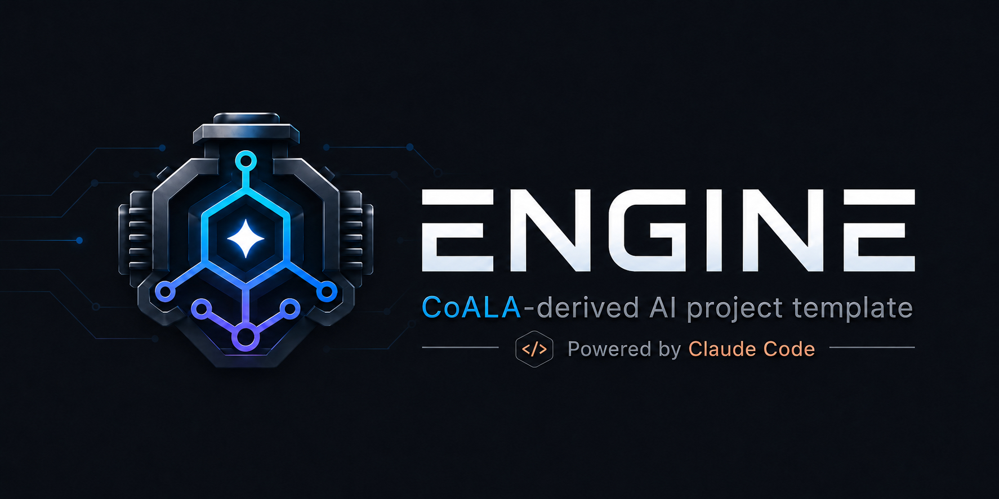

<!-- engine-template:landing-front -->

  

  
<strong>Direct the product. Engine carries the engineering work.</strong>

  

    
    
    
  

  
<a href="#get-started"><strong>Jump to Get started ↓</strong></a>

Engine is an engineering coworker for people who want to direct a software product without becoming its
engineer. You decide what to build, which tradeoffs to accept, and when to ship. Engine carries project
continuity, engineering execution, verification, and the evidence you need to judge the result.

## Why the Engine

An AI coding session can write code. A long-lived engineering coworker also has to understand the project,
challenge a weak plan, coordinate a build, verify the behavior, explain the risks, and come back tomorrow with
the same bearings. Engine keeps that working relationship in your repository so it survives cold sessions and
changes of model or runtime.

Its cognitive framing is directly inspired by the [CoALA paper](https://arxiv.org/abs/2309.02427): Engine uses
repository-based state, memory, knowledge, and attention functions to preserve project understanding and guide
engineering work. It adapts that framing for governed software delivery under human authority; CoALA is an
inspiration, not an implementation specification.

## What the Engine handles for you

**Keep the project understood across sessions.** Engine starts from a plain-language briefing, remembers
decisions and lessons, tracks where the work stands, maps how the repository fits together, and brings the most
relevant context forward. Its state, memory, knowledge, and attention live with the project rather than in one
model's temporary context, and rebuild from committed files if a live helper is unavailable.

**Shape work before code is written.** Engine helps turn an idea into a bounded plan, challenges assumptions,
checks the strongest case against the change, and records the decisions the build must preserve. Optional
product-design and plan-review modules add structured specification and cold review when you want them.

**Coordinate the Build.** Once you approve a plan, Engine binds implementation to that plan, breaks work into
coherent pieces, coordinates concurrent work where it is safe, integrates the result, and keeps every commit
headed toward one pull request. The Build coordinator carries plan authority, progress, review coverage, and
final evidence so a long or interrupted build can resume without inventing state.

**Verify and demonstrate the result.** Engine runs deterministic checks, requires an operator-runnable
demonstration where behavior can be shown, records review and repair, and composes an evidence-backed pull
request explaining what changed, what was verified, and what remains uncertain. Optional finished-work review
adds independent checks of conformance, technical integrity, usability, and release safety.

**Carry the project forward.** Engine supports releases, its own upgrades, planned unattended work, project
status, and periodic read-only self-review. Its authority stays bounded: consequential product and ship
decisions remain yours, and Engine never merges its own work.

## How you stay in control — evidence, not code review

Every change Engine proposes arrives as a pull request, and nothing reaches your protected `main` until you
merge it. Your approval can rest on an **evidence bundle** you can weigh:

- **A demonstration you run yourself** — and vary — to see the behavior with your own eyes.
- **Deterministic checks that must pass** before a change is offered to you.
- **A plain-language account** of what changed, why, and the risks and tradeoffs involved.

Those automatic checks mechanically hold a pull request until they pass. Passing checks do not approve
anything — your merge does, and it is the only thing that can. Because every change lands as a reviewable,
revertible pull request, a decision you regret is one you can undo.

## Optional modules

At setup you choose from optional add-ons, grouped by the part of the work they support. Leave out anything you
don't need — you can add it later, and each one is removable.

**Product management**

- **Product design** (`/engine-design`) — describe what you want to build in plain words, and the Engine helps
  you write it down clearly, checks it's complete and well-formed, and settles it as the description to build
  from. It checks the description, never whether the idea is a good one — that stays your call.
- **Project board** (`/engine-setup`) — a GitHub Projects board showing what's next, what needs your
  review, and known issues. Never required: the Engine works the same from your issues and pull requests, and
  you can delete the board later without losing anything.

**Software configuration management**

- **Migration discipline** — before a database change that could lose data or can't be undone, the Engine
  stops and brings you in — in plain language, with a safer option — instead of pressing ahead. A habit it
  follows, backed by your review; it never runs a migration for you.
- **Dependency discipline** — an automatic check on the outside libraries your project pulls in. It can block
  a change that brings in a known security hole or a risky license, with gentler nudges toward pinned
  versions; a genuinely unavoidable case can pass with a recorded decision.
- **Upstream contribution** — offer your changes to a project you don't own (an open-source project you've
  forked) as a pull request from your fork, carrying only your files and never the Engine's own.

**Verification & validation**

- **Plan review** — before a change is built, a fresh set of reviewers checks the plan: is it the right
  problem, is the design sound, can it be built and run safely.
- **Finished-work review** — before a built change is submitted, fresh reviewers check the finished work: does
  it do what was asked, is it soundly built, is it safe to release.

The two review packs are the cold reviewers that **strengthen** your evidence bundle. They only advise — they
never block, and your merge stays the only approval. Leave them out and that review step is simply disclosed as
not running, never passed off as a silent green.

## Get started

### Before you begin

- A **GitHub account**, and a repository created with **Use this template** (not a fork — see
  [Contributing](#contributing)).
- A current **Claude Code** or **Codex** release with project hooks support.
- The **GitHub CLI (`gh`) signed in** — otherwise assigning who reviews your changes, and the review gate
  itself, quietly defer until it is.

### The steps

1. **Create your repo.** Click **Use this template** at the top of this page.
2. **Open it in Claude Code or Codex.** *On Codex only:* approve the Engine's session hooks first, or setup won't start on its own.
3. **Run setup.** Say **"set up my project"** — or type `/engine-setup` (`$engine-setup` on Codex). The Engine
   walks you through a couple of choices: **how it commits on your behalf** (on your own, or with a team — a
   bigger setup with a security trade-off it explains), and **which optional add-ons to include**. Then it
   installs, wires, and verifies your selection.
4. **Two GitHub steps only you can do.**
   - Approve the **one-time authorization screen** that lets the Engine turn on branch protection. During
     setup, `gh` opens this screen in your browser — approve it there. Be aware the permission it asks for
     covers **all of your GitHub repositories, not just this one**; that breadth is real, though it only
     reaches repositories you already have access to, and it's what lets the Engine set up the review gate.
   - **Enable GitHub Actions** on the new repo (its **Actions** tab). Until you do, the automatic checks can't
     run — and *no* pull request can pass them, including setup's own.
5. **Turn on the two live helpers.** Approve the Engine's **memory** and **knowledge** servers — on Claude
   Code, when the app prompts (or in its settings); on Codex, by trusting the project in its settings — then
   **fully quit and reopen** the app. Until then the Engine runs on its committed-file fallback: it works, but
   can be out of date.

When setup finishes it removes its own walkthrough files and tells you it's done — that's your signal the Engine
is live. From there, just make your first request, or ask for a status readout to see where things stand.

### What setup handles for you

So the steps above don't read as more work than they are — here's what setup does on its own:

- Turns on the protected-`main` review gate and creates the labels it needs (both need `gh` signed in).
- Installs its own tool runtime into a private, git-ignored folder — never touching your system Python or your
  `PATH`.
- Swaps the template's README, instruction files, and license for your project's own starters. Your new repo
  will then show **"No license"** on GitHub — that's expected: the template's license shouldn't bind your
  project.
- Turns on **GitHub's own** secret scanning, push protection, and code scanning where your repo's plan supports
  them — best-effort and advisory, never a required merge check.
- Offers a private, off-repo backup of its memory, and removes its own setup scaffolding once it's done.

More on how first-run setup runs

Setup follows a fixed sequence — **gather → confirm → apply → verify → retire**. It reads your repo's
coordinates, asks only the choices it can't derive (how it commits, which add-ons), and writes those down as a
checkpoint **before it changes anything**. If it's interrupted after that point, the next session **resumes
from the checkpoint** rather than starting over or re-asking.

Apply is ordered and idempotent, and each step degrades with a plain-language reason rather than failing hard —
with one exception: if the one-time tool download can't complete (for example, you're offline), setup **stops
safely** and never falls back to a guess. It then verifies the result is coherent, pauses in plain words if
anything doesn't fit, and only removes its own setup files once that verify is clean — the setup tool's absence
afterward is the signal that setup is done.

Arriving into an existing ("brownfield") project is handled too: setup only replaces the Engine's *own*
traveled files and repairs an existing protection ruleset in place, so it never clobbers work you already have.

## Runtime support

Claude Code and Codex share one canonical Engine core: the same project state, memory, decisions, checks, and
Build evidence follow the repository between them. Each runtime receives native instructions, commands, hooks,
and live helpers rather than a separate Engine implementation.

On Claude Code, Engine commands use the `/engine-…` form. On Codex, they use `$engine-…`; approve the Engine's
project hooks when prompted, re-approve them when an Engine update asks you to, and trust the project before
enabling its live helpers. The setup flow above tells you when one of those runtime-specific actions is needed.

## Running unattended

The Engine can advance a *planned* build on a schedule while you're away — each run does one planned chunk,
adds its commits to an open pull request, and **never merges**. Your merge stays the only gate.

The short version: first plan the build in a normal, interactive session (a routine *advances* a plan, it
doesn't make one), then schedule `/engine-routine` as a Claude Desktop routine, pointed at that
build's branch in an isolated copy of the repo. When you're back, open a normal session and ask the Engine to
wrap the pull request up for your merge — a routine never finishes it for you.

Full setup for unattended routines

**First, plan the build (a normal, interactive session).** Before you schedule anything, work with the Engine
in a normal session to produce what it will follow: a plan you approve in that session — which the Engine then
publishes onto a suitable Issue as a frozen, promoted copy, naming the ordered steps and the files each may
touch — and an open **draft pull request** on a branch. The routine reads that promoted copy and adds
commits to that pull request, so point the schedule at that build's branch, not a fresh copy of your default
branch. With no plan to find, the first run has nothing to do and says so.

**On Claude Code — a Claude Desktop routine.** Create a routine and choose when it runs; put `/engine-routine`
in its Instructions; turn on **"Work in an isolated copy of the repo"** (the Engine refuses to write unless the
run is in a dedicated worktree, so this is required) and make sure that copy is on your build's branch; and set
the **permission mode** to the one that lets the session act without pausing to ask you.

**On Codex — keep Engine builds interactive.** The former `$engine-routine` Automation is retired: Codex's one
shared scheduled sandbox plus unattended repository credentials cannot preserve the promise that only you merge.
If one exists, open **Scheduled** in the desktop sidebar, find the recurring task whose prompt contains
`$engine-routine`, and pause or delete it; confirm it no longer appears under Active. Use Codex interactively, or
use the Claude Desktop routine above when you need unattended writes. This is deliberately the simpler supported
path; the canonical reasoning is in `.engine/operations/codex-settings.md`.

**For the Claude routine — confirm before you rely on it.**

- Keep the computer on and the app running during the scheduled time — a local run only works while your
  machine is awake.
- git/GitHub credentials must be reachable to a scheduled run **without** an interactive prompt — otherwise it
  can't push or even leave an Issue.

You'll see each run in your scheduling app's history and its progress on the pull request. If a run can't
safely start — hooks not running, or not isolated — it reports why and stops. It files a GitHub Issue only for
something it hits mid-build that needs you; when GitHub itself is unreachable it can't file one, so the run's
own history in the app is the only record of that. **The routine never finishes the pull request** — when
you're back, open a normal session and ask the Engine to wrap it up, review it for cohesion, and submit it for
your merge.

The Engine's periodic **self-review** — its own health check — can run unattended through the durable GitHub
schedule or a Claude Cloud Routine. Codex scheduled self-review is retired because Codex cannot give that audit
a separate Read Only sandbox; run it interactively in a Read Only Codex task instead. See
[Setting up the engine's scheduled self-review](.engine/audits/self-review-setup.md).

## Roadmap

Engine's current core is focused on repository-native engineering work and evidence-backed pull requests. Its
future delivery work extends that same engineering-coworker role in this settled order:

1. **Stronger local delivery and evidence** — deepen implementation, testing, demonstrations, and proof around
   changes built in the local repository.
2. **Controlled execution environments** — run software and its checks in bounded, reproducible environments.
3. **Web delivery and debugging** — add browser-based demonstrations, web diagnostics, and interactive
   debugging evidence.
4. **Bounded deployment** — connect reviewed changes to deployment through explicit adapters and human-held
   authority.
5. **Operations, maintenance, and repair** — observe shipped software, maintain it, diagnose failures, and make
   bounded repairs with the same evidence and approval model.
6. **Larger-program and platform coordination** — coordinate related products, shared infrastructure, and
   longer delivery programs without collapsing their separate authority.
7. **Richer operator views and product learning** — make product state, evidence, system structure, and
   post-delivery learning easier to explore and govern.

## Contributing

A contribution model for the Engine is not defined yet. One behavior to revisit when it is: a repository
**forked** from this one is currently treated as a contributor's fork, so the Engine does not prompt it at
session start to run first-run setup (the boot setup offer is suppressed for forks of the Engine's own home).
The sanctioned way to *adopt* the Engine is **Use this template**, not a fork — but anyone who does adopt by
forking won't see that start-up prompt (they can still run `/engine-setup` directly). When contribution is
defined, we'll decide whether a fork-based adopter needs a distinct signal.

## License

Licensed under the [Apache License 2.0](LICENSE). You may use, modify, fork, and redistribute the Engine —
including commercially — subject to the license's attribution and notice terms. Apache-2.0 is an OSI-approved
permissive open-source license with an express patent grant, so GitHub shows this template repository's license
as a named "Apache-2.0". See [LICENSE](LICENSE) for the governing terms.
